## EXNO-3-DS

# AIM:
To read the given data and perform Feature Encoding and Transformation process and save the data to a file.

# ALGORITHM:
STEP 1:Read the given Data.
STEP 2:Clean the Data Set using Data Cleaning Process.
STEP 3:Apply Feature Encoding for the feature in the data set.
STEP 4:Apply Feature Transformation for the feature in the data set.
STEP 5:Save the data to the file.

# FEATURE ENCODING:
1. Ordinal Encoding
An ordinal encoding involves mapping each unique label to an integer value. This type of encoding is really only appropriate if there is a known relationship between the categories. This relationship does exist for some of the variables in our dataset, and ideally, this should be harnessed when preparing the data.
2. Label Encoding
Label encoding is a simple and straight forward approach. This converts each value in a categorical column into a numerical value. Each value in a categorical column is called Label.
3. Binary Encoding
Binary encoding converts a category into binary digits. Each binary digit creates one feature column. If there are n unique categories, then binary encoding results in the only log(base 2)ⁿ features.
4. One Hot Encoding
We use this categorical data encoding technique when the features are nominal(do not have any order). In one hot encoding, for each level of a categorical feature, we create a new variable. Each category is mapped with a binary variable containing either 0 or 1. Here, 0 represents the absence, and 1 represents the presence of that category.

# Methods Used for Data Transformation:
  # 1. FUNCTION TRANSFORMATION
• Log Transformation
• Reciprocal Transformation
• Square Root Transformation
• Square Transformation
  # 2. POWER TRANSFORMATION
• Boxcox method
• Yeojohnson method

# CODING AND OUTPUT:

```python
import pandas as pd
```

```python
df=pd.read_csv(r"C:\Users\admin\DataScience\EXNO-3-DS\Encoding Data.csv")
df
```
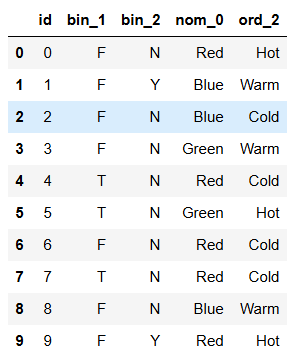  

```python
df.tail()
```
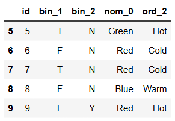  

```python
df.describe()
```
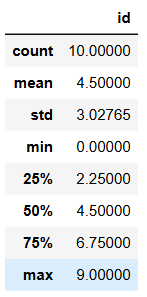  

```python
df.info()
```
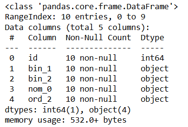  

```python
df.shape
```
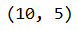  

## Ordinal Encoder

```python
from sklearn.preprocessing import LabelEncoder,OrdinalEncoder
pm=['Hot','Warm','Cold']
dfe1 = df.copy()
e1 = OrdinalEncoder(categories=[pm])
dfe1['bo2']=e1.fit_transform(df[["ord_2"]])
dfe1
```
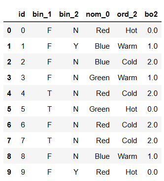  

## Label Encoder

```python
le=LabelEncoder()
dfc=df.copy()
dfc["ord_2"] = le.fit_transform(df["ord_2"])
dfc
```
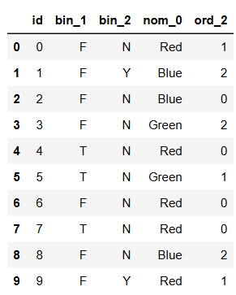  

## One Hot Encoder

```python
from sklearn.preprocessing import OneHotEncoder
ohe=OneHotEncoder(sparse_output=False)
df2=df.copy()
df2["nom_0"] = ohe.fit_transform(df2[["nom_0"]])
df2
```
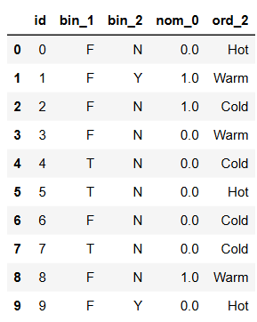  

```python
dfohe = pd.get_dummies(df["nom_0"])
dfohe
df3 = df.copy()
df3 = pd.concat([df3, dfohe], axis=1)
df3
```
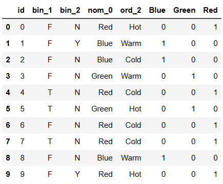  

## Binary Encoder

```python
pip install --upgrade category_encoders
```
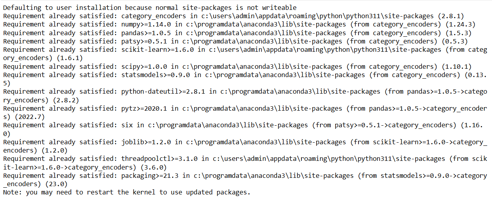  

```python
from category_encoders import BinaryEncoder
df=pd.read_csv(r"C:\Users\admin\DataScience\EXNO-3-DS\data.csv")
df
```
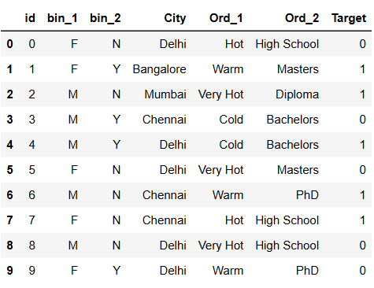  

```python
be=BinaryEncoder()
dfbe = be.fit_transform(df["Ord_2"])
dfbe
```
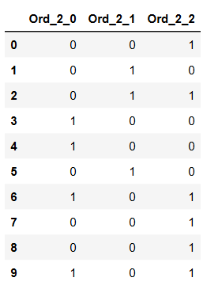  

```python
dfbe = pd.concat([df, dfbe], axis=1)
dfbe
```
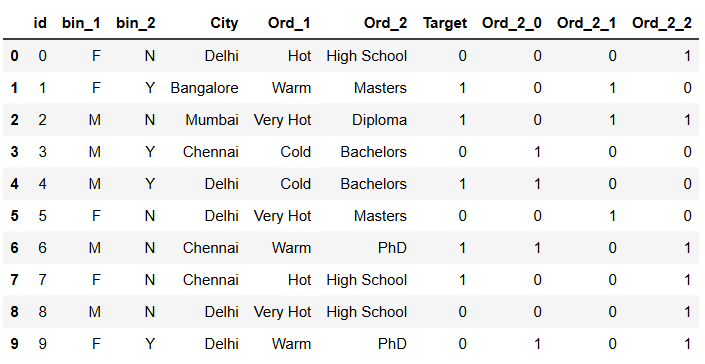  

## Target Encoder

```python
from category_encoders import TargetEncoder
te=TargetEncoder()
cc=df.copy()
dfte = te.fit_transform(df["City"], df["Target"])
cc = pd.concat([cc, dfte], axis=1)
cc
```
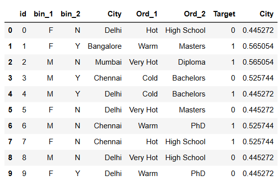  

## Feature Transformation

```python
import pandas as pd
from scipy import stats
import numpy as np
df=pd.read_csv(r"C:\Users\admin\DataScience\EXNO-3-DS\Data_to_Transform.csv")
df
```
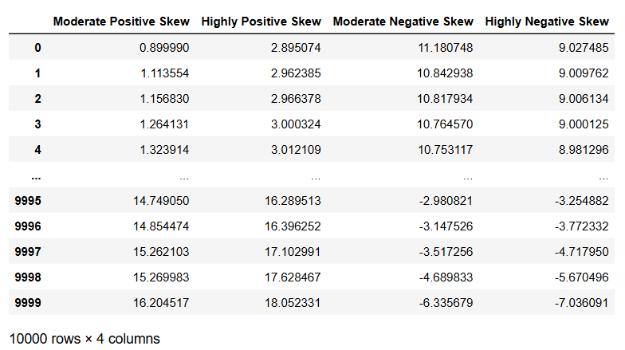  

```python
df.skew()
```
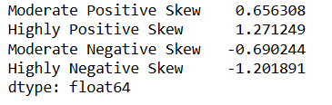  

```python
dftrans = df.copy()
dftrans["Moderate Positive Skew"] = np.sqrt(df["Moderate Positive Skew"])
dftrans
```
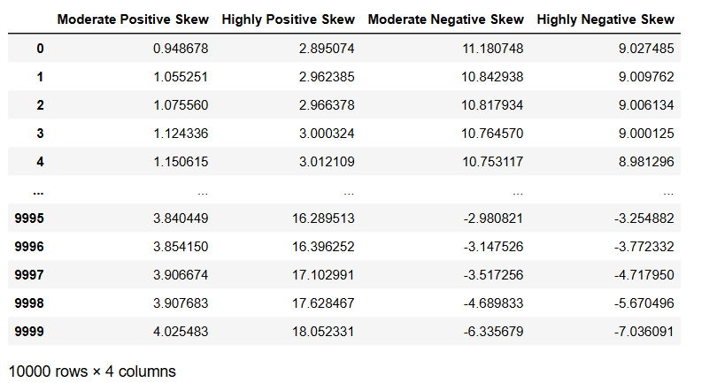  

```python
dftrans["Highly Positive Skew"] = np.square(df["Highly Positive Skew"])
dftrans
```
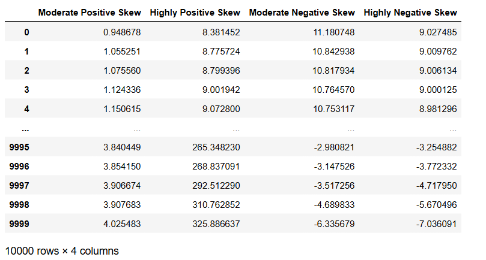  

```python
dftrans["Moderate Negative Skew"] = np.reciprocal(df["Moderate Negative Skew"])
dftrans
```
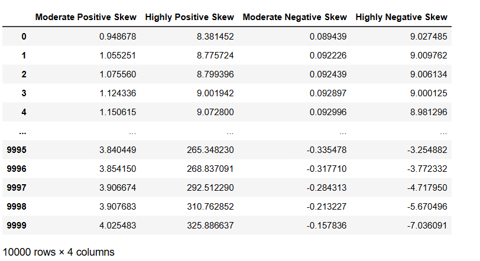  

```python
dftrans["Highly Positive Skew"] = np.log(df["Highly Positive Skew"])
dftrans
```
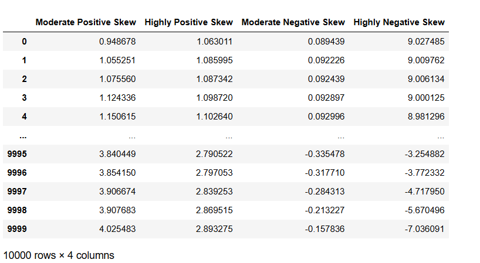  

## BoxCox and YeoJohnSon Method

```python
import matplotlib.pyplot as plt
import seaborn as sns
import statsmodels.api as sm
import scipy.stats as stats
df["Highly Positive Skew_BoxCox"], parameter = stats.boxcox(df["Highly Positive Skew"])
df
```
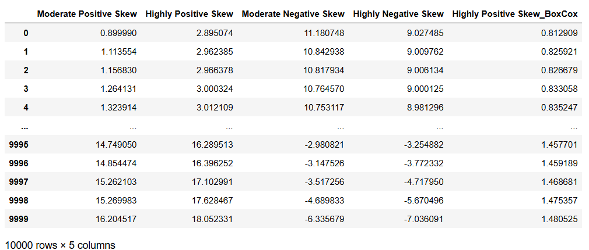  

```python
df["Highly Negative Skew_YeoJohnson"], parameter = stats.yeojohnson(df["Highly Negative Skew"])
df
```
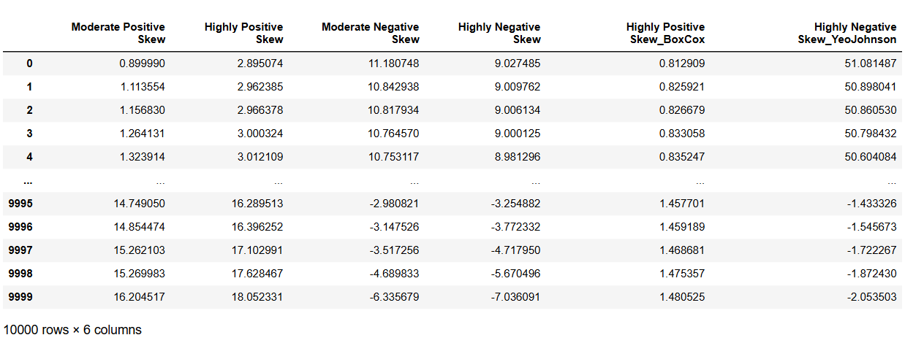  

```python
from sklearn.preprocessing import QuantileTransformer
qt=QuantileTransformer(output_distribution='normal',n_quantiles=891)
df["Moderate Negative Skew_QT"]=qt.fit_transform(df[["Moderate Negative Skew"]])
sm.qqplot(df["Moderate Negative Skew"],line='45')
plt.show()
```
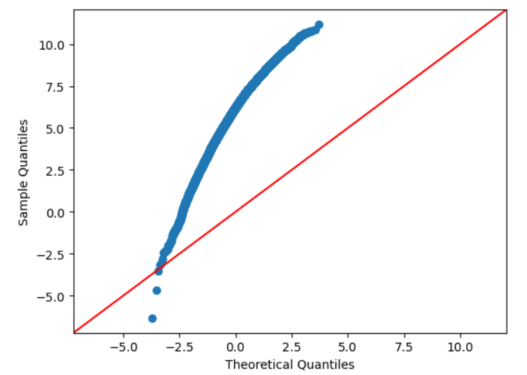  

```python
sm.qqplot(df["Moderate Negative Skew_QT"],line='45')
plt.show()
```
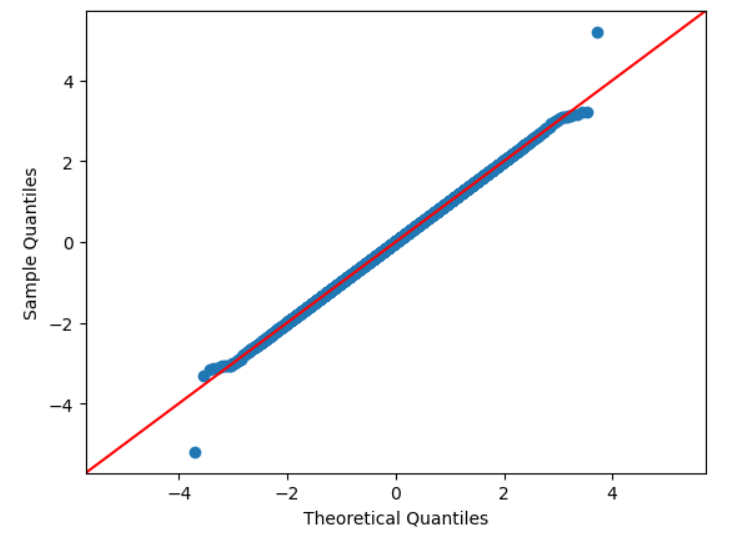  

```python
df["Highly Negative Skew_QT"]=qt.fit_transform(df[["Highly Negative Skew"]])
sm.qqplot(df['Highly Negative Skew'],line='45')
plt.show()
```
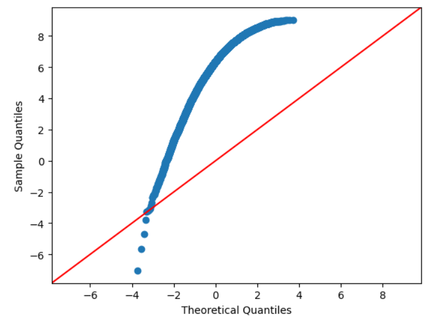  

```python
sm.qqplot(df['Highly Negative Skew_QT'],line='45')
plt.show()
```
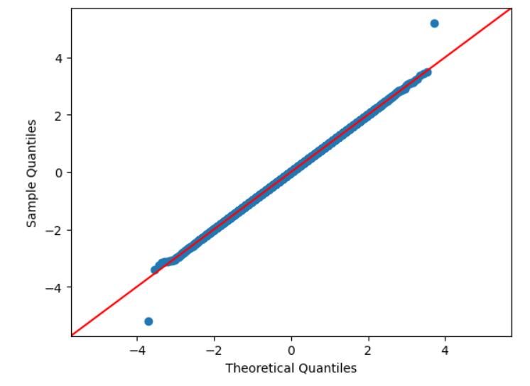  

```python
sm.qqplot(np.reciprocal(df["Moderate Negative Skew"]),line='45')
plt.show()
```
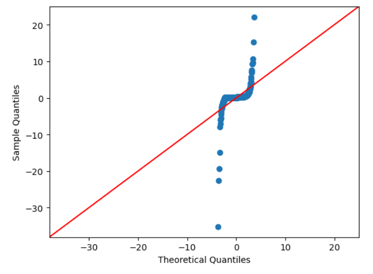  


# RESULT:
        Thus the given data,Feature Encoding,Transformation process and save the data to a file was performed successfully.

       


       
